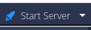
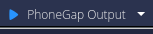
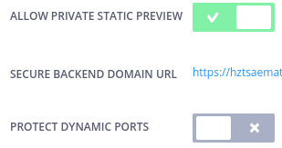
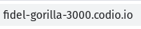
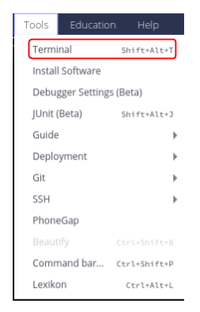

# Codio and PhoneGap
The steps below walk through the steps to create a project using PhoneGap.

## No Guide
Most of the content written for the Codio platform makes use of the Guide. However, PhoneGap works better when it is not running in the background of the Guide. Instead, Codio will automatically load the `README.md` file by default. Instructions for students should go here. Unfortunately, this means that features like auto-graded assessments and the code visualizer will not be available since the Guide is not being used.

## HTML/CSS/JS Files
In the file tree to the left, open `myApp` and then the `www` folder. The HTML file is `index.html`, while the CSS and JS files can be found in their respective folders. Click on the file to open it in an editor.

## Debugger
The Codio IDE comes with a powerful visual debugger. Currently we support Python, Java, C, C++ and NodeJS. Other languages can be added on request.
[Debugger documentation](https://codio.com/docs/ide/features/debugging/)

## Viewing the Output
Viewing the output is a two-step process. First, serve the PhoneGap project and then open port 3000. There are two buttons in the Codio menu bar at the top of the page that handle these two steps. Click the "Start Server" button to serve the PhoneGap app.



Next, click on "PhoneGap Output" to see the output from the student work. A new tab should open with PhoneGap running.



You can also see the output running on a mobile device. In order to do this, you must first change two project settings. In the Codio menu bar, click "Project" and then "Settings...". Make sure that you turn on private static preview and turn off protect dynamic ports.



Click the two buttons as mentioned above. Then type the project's URL into a mobile browser.



## Creating Your Own Project
By default, the PhoneGap starter pack uses the project named `myApp`. This folder can be renamed, however the "Start Server" button will no longer work. This button calls the Python script `start_server.py`. This script expects a PhoneGap folder with the name `myApp`. If you change the folder name, change the script to reflect the new folder name.

```python
import os
os.chdir("new_folder_name/www")
os.system("phonegap serve --no-browser")
```

You can always create a new PhoneGap project by opening a terminal window. 



Use the command `phonegap create project_name` to create a new project. Update the Python script to reflect this change.

## PhoneGap Build
Codio [integrates](https://codio.com/docs/ide/tools/phonegap/) with the PhoneGap Build process. 